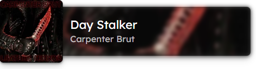

# **OBS music widget with Last.fm integration 🎵**

This widget is a simple OBS widget that displays the current song playing in your OBS scene. It uses the Last.fm API to get the current song playing on your Spotify account.

### **This is how it looks like (in OBS the widget is transparent):**


### **How to use it ⚙**
1. Clone the repository
2. Run `npm install` (or in my case `bun install`)
3. Create a `.env` file in the root of the project with the following content:
```sh
VITE_LAST_FM_API_KEY=your_lastfm_api_key
VITE_LAST_FM_USERNAME=your_lastfm_username
```

*VITE variables are used to expose the variables to the client side.*

You can create your account [here](https://www.last.fm/es/home). You can get your Last.fm API key [here](https://www.last.fm/api/account/create).

4. Run `npm run dev` (or in my case `bun run dev`) or deploy the project to Vercel or Netlify.
   
5. Add the URL of the deployed project to OBS as a browser source.

6. **Enjoy! 📻 🎶**
